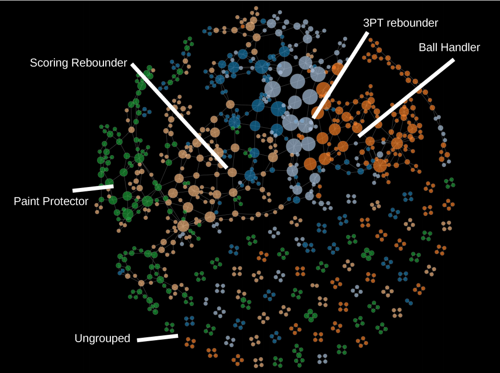

# About the project

Please check the project final report [here](https://github.com/Gabriel-Azevedo-Ferreira/TDA-NBA/blob/master/Final%20report%20-%20Projet%203A%20-%20Gabriel%20Azevedo%2C%20Gustavo%20Castro%2C%20Henrique%20Gasparini.pdf), or the presentation made [here](https://github.com/Gabriel-Azevedo-Ferreira/TDA-NBA/blob/master/Projet_3A___Pr_sentation.pdf)
for a detailed explaination of this work.

# Extracting Insights from NBA player positions using Topological Data Analysis (TDA)

In this work, we analyzed the statistics from the 2015-2016 NBA season using well-known
algorithms and **topological algorithms**, inspired by the work of **M. Alagappan** [here](https://github.com/Gabriel-Azevedo-Ferreira/TDA-NBA/blob/master/papers/srep01236.pdf)
. We first
used traditional algorithms to understand the general properties of the data, as well as the
strength of the actual field positions as determinants of playing styles, and then proceeded to
a more complex abstraction given by the **Mapper algorithm**, implemented in the R package
TDAmapper.

By analyzing the topological structure of the data returned by the Mapper algorithm and
comparing it to the structure obtained in Alagappan’s work, we could capture a more comprehensive
understanding of playing-styles. By identifying the majority of the field positions that
were defined in his paper, we empirically proved the robustness of the Mapper algorithm, as
we used a more recent dataset from five years later than his.

# Steps on this work

- We first tried dimensionality reduction techniques in order to relate basketball playing styles to high level concepts represented by the lower dimensions.
- We used feature selection techniques to select features that would represent the positions. Seven features were selected (Rebounds,
Turnovers,
Blocks,
Points,
Assists,
Steals,
Personal Fouls)

- Clustering were fit algorithms to the resulting data set, as a preparation to train the Mapper algorithm
- Finally, we used a TDA approach to extract the shape of the high dimensional data found. We applied the Mapper algorithm and analysed the result, comparing with M. Alagappan’s. 

# Interesting Findings

## Dimensionality reduction

When applying Principal Component Analysis (PCA) to the original dataset, we found the that the two dimensions that explain most of the variance have a high level interpretation:

- The first PCA component is related to the players ability level. We found this component to be highly correlated to the player's salary and the number of games played during the season.
- The second component was found to relate to the player's style, quantified in an "attacking" gradient. Players classified as "forward" present a higher values for that component, while defense players present lower values. This Dimension is highly correletated with the number of rebounds of a player, and negatively correlated to the 3 points attempts made.

From the "V" shape of the PCA we concluded that there is probably a less clear mark of the player style when the player's ability is not highly pronouced. Players with high dimension 1 (high ability) have very distict attacking levels, while for players with lower first dimension value it may not be so easy to classify their position based on the statistics.

## Mapper Algorithm result

A description of the Mapper algorithm can be found [here](https://github.com/Gabriel-Azevedo-Ferreira/TDA-NBA/blob/master/papers/mapperPBG.pdf).

The result of applying the algorithm is shown below.

This result shows a clear distiction on the players positions in space. The different colors represent the different playing positions, which gradually changed. The positions noted are the ones proposed by M. Alagapan.

The results from the paper (based on NBA 2013 season) were not totally mapped into the 2015 season, as some of the positions proposed on Alagapan's work were not identifiable. This seems to indicate that the particular scenario, in terms playing styles, changed from 2013 to 2015, and the different classification proposed by M. Alagapan might not be stable.

